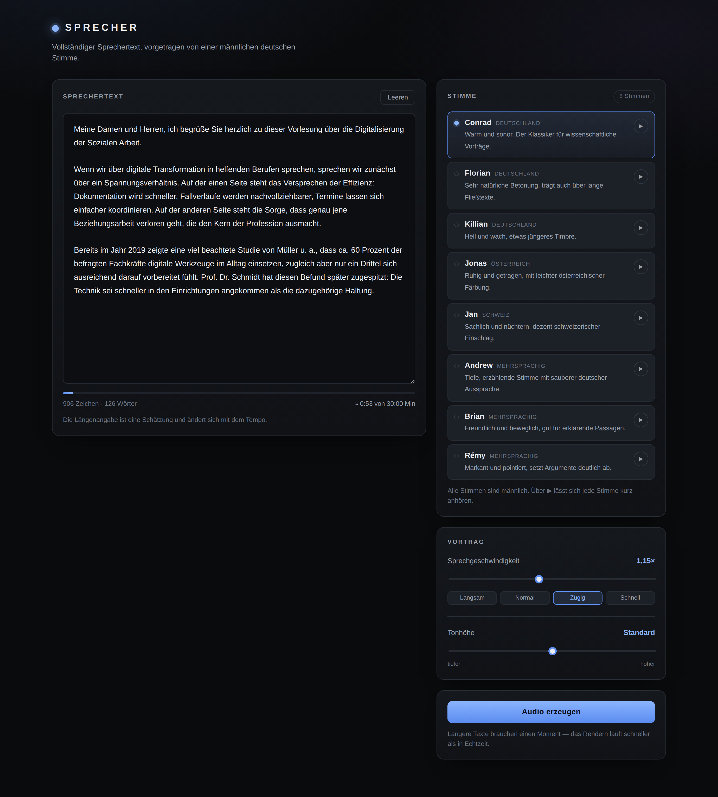

# SPRECHER

Text-to-Speech für lange Vortrags- und Sprechertexte. Text einfügen, Stimme und
Tempo wählen, MP3 herunterladen — bis zu 30 Minuten am Stück, ausschließlich
männliche deutsche Stimmen.



## Starten

Voraussetzung ist Python 3.9 oder neuer (auf dem Mac bereits vorhanden).

```bash
cd sprecher
./start.command
```

Auf dem Mac lässt sich `start.command` auch im Finder doppelklicken. Das Skript
legt beim ersten Start eine eigene Python-Umgebung im Ordner `.venv` an,
installiert `edge-tts` hinein und startet den Server; jeder weitere Start geht
sofort. Das System-Python bleibt unangetastet.

Der Browser öffnet sich automatisch auf <http://127.0.0.1:8765>.
Beenden mit `Strg+C`.

Optionen werden durchgereicht: `./start.command --port 9000`, `--host 0.0.0.0`,
`--no-browser`.

### Von Hand

```bash
cd sprecher
python3 -m venv .venv
source .venv/bin/activate
pip install -r requirements.txt
python3 server.py
```

Wichtig auf dem Mac: Es gibt dort in der Regel keinen Befehl `pip`, sondern nur
`pip3` beziehungsweise `python3 -m pip`. Innerhalb einer aktivierten Umgebung
(`source .venv/bin/activate`) funktioniert `pip` dann wie gewohnt.

## Bedienung

1. **Sprechertext einfügen.** Leerzeilen trennen Absätze — an jeder Absatzgrenze
   setzt der Sprecher eine kurze Atempause. Die Anzeige unter dem Textfeld zeigt
   laufend, wie lang die Aufnahme ungefähr wird.
2. **Stimme wählen.** Acht männliche Stimmen stehen zur Verfügung. Über die
   ▶-Schaltfläche neben jeder Stimme lässt sich ein kurzer Satz probehören —
   mit dem aktuell eingestellten Tempo.
3. **Tempo und Tonhöhe einstellen.** Geschwindigkeit von 0,5× bis 2,0×, dazu vier
   Voreinstellungen. Die Tonhöhe verschiebt die Stimmlage um bis zu ±20 Hz.
4. **Audio erzeugen.** Der Text wird in Abschnitte zerlegt und nacheinander
   vertont; der Fortschritt ist sichtbar und lässt sich abbrechen.
5. **Anhören und herunterladen.** Das Ergebnis liegt als eine einzige MP3-Datei
   vor und kann direkt im Player geprüft werden.

Text, Stimme, Tempo und Tonhöhe bleiben im Browser gespeichert und stehen beim
nächsten Start wieder bereit.

## Stimmen

| Stimme  | Herkunft      | Charakter                                            |
|---------|---------------|------------------------------------------------------|
| Conrad  | Deutschland   | warm und sonor, der Klassiker für Vorträge            |
| Florian | Deutschland   | sehr natürliche Betonung, trägt über lange Fließtexte |
| Killian | Deutschland   | hell und wach, etwas jüngeres Timbre                  |
| Jonas   | Österreich    | ruhig und getragen, leichte österreichische Färbung   |
| Jan     | Schweiz       | sachlich und nüchtern, dezent schweizerischer Einschlag |
| Andrew  | mehrsprachig  | tiefe, erzählende Stimme mit sauberer Aussprache      |
| Brian   | mehrsprachig  | freundlich und beweglich, gut für erklärende Passagen |
| Rémy    | mehrsprachig  | markant und pointiert, setzt Argumente deutlich ab    |

Beim Start prüft der Server die Liste gegen den Katalog des Sprachdienstes.
Fällt eine Stimme weg, rückt automatisch eine andere männliche Stimme nach.

## Technischer Hintergrund

* **Sprachsynthese:** [`edge-tts`](https://github.com/rany2/edge-tts) — die
  neuronalen Stimmen von Microsoft Edge. Kostenlos, ohne Konto und ohne
  API-Schlüssel, aber **eine Internetverbindung ist erforderlich**.
* **Server:** ausschließlich Python-Standardbibliothek (`http.server`), keine
  weiteren Abhängigkeiten. Alles läuft lokal; der Text verlässt den Rechner nur
  in Richtung des Sprachdienstes.
* **Lange Texte:** Der Text wird an Satzgrenzen in Abschnitte von rund 1.600
  Zeichen zerlegt. Abkürzungen wie „z. B.“, „Prof. Dr.“ oder Datumsangaben wie
  „am 3. Januar“ werden dabei nicht als Satzende missverstanden. Die
  MP3-Abschnitte werden anschließend zu einer Datei zusammengefügt
  (24 kHz, 48 kbit/s, mono).
* **30-Minuten-Grenze:** Vor dem Start wird die Länge geschätzt und zu lange
  Texte werden abgelehnt. Läuft die Aufnahme dennoch über, wird sie exakt bei
  30:00 Minuten an einer Frame-Grenze beendet und im Ergebnis als gekürzt
  ausgewiesen.
* **Abbruchsicherheit:** Einzelne Abschnitte werden bei Netzfehlern bis zu
  dreimal wiederholt.

## Tests

```bash
python3 test_sprecher.py
```

Der Test ersetzt den Aufruf des Sprachdienstes durch einen Simulator und läuft
deshalb ohne Internetverbindung. Geprüft werden das Zusammenfügen der
Abschnitte, die Weitergabe von Tempo und Tonhöhe, die 30-Minuten-Kappung, der
Abbruch, die Hörprobe sowie Download- und Range-Anfragen.
